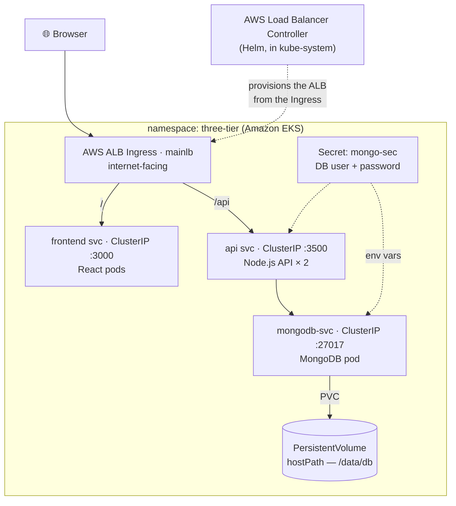

# Three-Tier App on AWS EKS

Deploying a full **three-tier web application** — a **React** frontend, a **Node.js / Express** API, and a **MongoDB** database — **live on Amazon EKS**, exposed to the internet through a single **AWS Application Load Balancer (ALB) Ingress**.

Each tier runs as its own Deployment + Service in a dedicated `three-tier` namespace. Container images are stored in **Amazon ECR**, the cluster is provisioned with **`eksctl`**, and the public entry point is created by the **AWS Load Balancer Controller**.


---

## Architecture

An internet-facing ALB routes `/` to the React frontend and `/api` to the Node.js API. The API reaches MongoDB by its in-cluster Service name; MongoDB persists to a PersistentVolume and reads its credentials from a Kubernetes Secret. All Services are `ClusterIP` — only the ALB is public.



| Tier | Component | Service type | Port |
|------|-----------|--------------|------|
| Presentation | React SPA | ClusterIP (via Ingress `/`) | `3000` |
| Application | Node.js / Express API (`replicas: 2`, liveness+readiness on `/ok`) | ClusterIP (via Ingress `/api`) | `3500` |
| Data | MongoDB (`Secret` + `PV`/`PVC`) | ClusterIP | `27017` |

---

## Repository layout

```
.
├── Kubernetes-Manifests-file/     # ← the EKS deployment (core of this project)
│   ├── Database/
│   │   ├── secrets.yaml               # mongo-sec (base64 — set your own values)
│   │   ├── pv.yaml / pvc.yaml         # persistent storage for MongoDB
│   │   ├── deployment.yaml            # MongoDB Deployment (reads creds from Secret)
│   │   └── service.yaml               # mongodb-svc (ClusterIP)
│   ├── Backend/
│   │   ├── deployment.yaml            # Node API × 2 + health probes + ECR image
│   │   └── service.yaml               # api (ClusterIP :3500)
│   ├── Frontend/
│   │   ├── deployment.yaml            # React + ECR image + REACT_APP_BACKEND_URL
│   │   └── service.yaml               # frontend (ClusterIP :3000)
│   └── ingress.yaml                   # mainlb — the ALB Ingress (/ and /api)
└── Application-Code/
    ├── backend/                   # Node.js / Express API + Dockerfile
    └── frontend/                  # React app + Dockerfile
```

> **Placeholders to fill in before deploying:** `<your-aws-account-id>` (ECR image URLs), `<your-domain>` (Ingress host + `REACT_APP_BACKEND_URL`), and the base64 values in `secrets.yaml`.

---

## Deploy it yourself

**Prerequisites:** an EC2 "control machine" with the AWS CLI, Docker, `kubectl`, `eksctl`, and Helm installed, and an AWS account (ECR + EKS permissions).

```bash
# 1) Build each tier's image and push to Amazon ECR
#    (run inside Application-Code/backend and Application-Code/frontend)
docker build -t backend .
docker tag backend:latest <your-aws-account-id>.dkr.ecr.us-east-1.amazonaws.com/backend:latest
aws ecr get-login-password --region us-east-1 \
  | docker login --username AWS --password-stdin <your-aws-account-id>.dkr.ecr.us-east-1.amazonaws.com
docker push <your-aws-account-id>.dkr.ecr.us-east-1.amazonaws.com/backend:latest   # repeat for frontend

# 2) Create the EKS cluster (~15 min)
eksctl create cluster --name three-tier-cluster --region us-west-2 \
  --node-type t2.medium --nodes-min 2 --nodes-max 2
aws eks update-kubeconfig --region us-west-2 --name three-tier-cluster

# 3) Namespace + a pull secret for the private ECR images
kubectl create namespace three-tier
kubectl create secret docker-registry ecr-registry-secret \
  --docker-server=<your-aws-account-id>.dkr.ecr.us-east-1.amazonaws.com \
  --docker-username=AWS \
  --docker-password=$(aws ecr get-login-password --region us-east-1) -n three-tier

# 4) Deploy all three tiers
kubectl apply -f Kubernetes-Manifests-file/Database/
kubectl apply -f Kubernetes-Manifests-file/Backend/
kubectl apply -f Kubernetes-Manifests-file/Frontend/

# 5) Install the AWS Load Balancer Controller, then apply the Ingress
#    (IAM policy + OIDC service account + Helm chart — see below), then:
kubectl apply -f Kubernetes-Manifests-file/ingress.yaml
kubectl get ingress -n three-tier   # wait for the ALB ADDRESS, then open it
```

<details>
<summary>Install the AWS Load Balancer Controller (IAM + OIDC + Helm)</summary>

```bash
curl -O https://raw.githubusercontent.com/kubernetes-sigs/aws-load-balancer-controller/v2.5.4/docs/install/iam_policy.json
aws iam create-policy --policy-name AWSLoadBalancerControllerIAMPolicy --policy-document file://iam_policy.json
eksctl utils associate-iam-oidc-provider --region=us-west-2 --cluster=three-tier-cluster --approve
eksctl create iamserviceaccount --cluster=three-tier-cluster --namespace=kube-system \
  --name=aws-load-balancer-controller --role-name AmazonEKSLoadBalancerControllerRole \
  --attach-policy-arn=arn:aws:iam::<your-aws-account-id>:policy/AWSLoadBalancerControllerIAMPolicy \
  --approve --region=us-west-2
helm repo add eks https://aws.github.io/eks-charts && helm repo update eks
helm install aws-load-balancer-controller eks/aws-load-balancer-controller -n kube-system \
  --set clusterName=three-tier-cluster \
  --set serviceAccount.create=false --set serviceAccount.name=aws-load-balancer-controller
```
</details>

> 💸 **Tear it down when finished** — EKS bills by the hour (control plane + worker nodes + ALB):
> ```bash
> eksctl delete cluster --name three-tier-cluster --region us-west-2
> ```
> Then confirm in the console that the ALB and any leftover security groups are gone, and stop the control-machine EC2.

---

## What this project demonstrates

- Provisioning a managed **Amazon EKS** cluster end-to-end with **`eksctl`** (control plane, VPC, managed node group)
- **Multi-tier deployment** on Kubernetes: Deployments, Services, namespaces, and cross-tier **service discovery** by Service name
- **Private image registry** workflow with **Amazon ECR** and `imagePullSecrets`
- **Persistent storage** (PV/PVC) and **Secrets** for database credentials
- **Health checks** — liveness & readiness probes for reliable rolling updates and self-healing
- **Ingress + ALB**: exposing multiple tiers through one load balancer, routed by path (`/` and `/api`), via the **AWS Load Balancer Controller** (Helm + IAM/OIDC)
- **Cost hygiene**: full teardown with `eksctl` to avoid ongoing AWS charges

---

## Notes

The Kubernetes manifests use `<...>` placeholders for account- and domain-specific values — replace them with your own before deploying. Kubernetes Secrets are only base64-encoded (not encrypted), so never commit real credentials; generate your own values and, for production, use a sealed-secrets tool or an external secrets manager.
