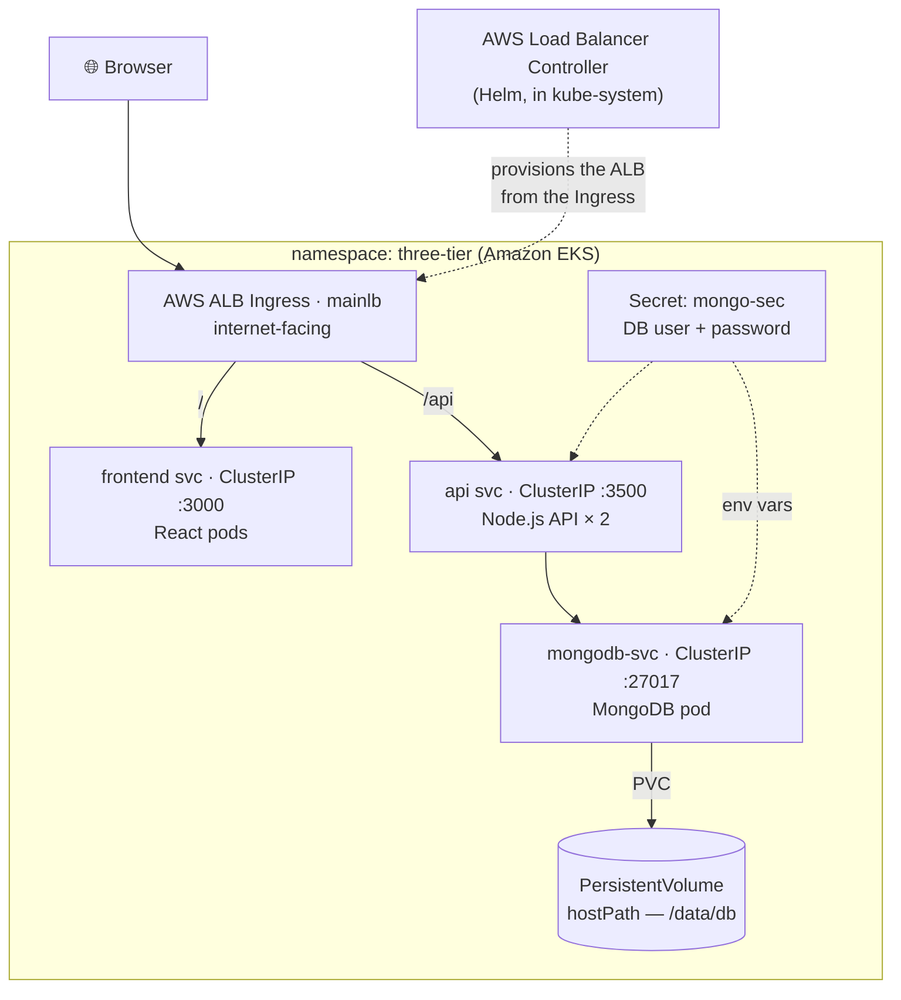

# Three-Tier App on AWS EKS

Deploying a full **three-tier web application** — a **React** frontend, a **Node.js / Express** API, and a **MongoDB** database — **live on Amazon EKS**, exposed to the internet through a single **AWS Application Load Balancer (ALB) Ingress**.

Each tier runs as its own Deployment + Service in a dedicated `three-tier` namespace. Container images are stored in **Amazon ECR**, the cluster is provisioned with **`eksctl`**, and the public entry point is created by the **AWS Load Balancer Controller**.


---

## Architecture

An internet-facing ALB routes `/` to the React frontend and `/api` to the Node.js API. The API reaches MongoDB by its in-cluster Service name; MongoDB persists to a PersistentVolume and reads its credentials from a Kubernetes Secret. All Services are `ClusterIP` — only the ALB is public.



| Tier | Component | Service type | Port |
|------|-----------|--------------|------|
| Presentation | React SPA | ClusterIP (via Ingress `/`) | `3000` |
| Application | Node.js / Express API (`replicas: 2`, liveness+readiness on `/ok`) | ClusterIP (via Ingress `/api`) | `3500` |
| Data | MongoDB (`Secret` + `PV`/`PVC`) | ClusterIP | `27017` |

---

## Repository layout

```
.
├── Kubernetes-Manifests-file/     # ← the EKS deployment (core of this project)
│   ├── Database/
│   │   ├── secrets.yaml               # mongo-sec (base64 — set your own values)
│   │   ├── pv.yaml / pvc.yaml         # persistent storage for MongoDB
│   │   ├── deployment.yaml            # MongoDB Deployment (reads creds from Secret)
│   │   └── service.yaml               # mongodb-svc (ClusterIP)
│   ├── Backend/
│   │   ├── deployment.yaml            # Node API × 2 + health probes + ECR image
│   │   └── service.yaml               # api (ClusterIP :3500)
│   ├── Frontend/
│   │   ├── deployment.yaml            # React + ECR image + REACT_APP_BACKEND_URL
│   │   └── service.yaml               # frontend (ClusterIP :3000)
│   └── ingress.yaml                   # mainlb — the ALB Ingress (/ and /api)
└── Application-Code/
    ├── backend/                   # Node.js / Express API + Dockerfile
    └── frontend/                  # React app + Dockerfile
```

> **Placeholders to fill in before deploying:** `<your-aws-account-id>` (ECR image URLs + IAM policy ARN), `<your-domain>` (Ingress host + `REACT_APP_BACKEND_URL`), and the base64 values in `secrets.yaml`.

---

## Prerequisites

- An **AWS account** with permissions to use EKS, EC2, ECR, IAM, and Elastic Load Balancing.
- A small **Ubuntu EC2 "control machine"** (e.g. `t2.medium`) from which you run everything below — it is *not* part of the cluster.
- Basic familiarity with Docker and the AWS console.

> 💸 **Heads-up on cost:** EKS is not free — the control plane is ~$0.10/hour, plus the EC2 worker nodes and the ALB. Follow the [Cleanup](#cleanup) step the moment you're done so nothing keeps billing.

---

## Deployment — step by step

### Step 1: IAM configuration

Create an IAM user for this project and generate programmatic credentials:

- Create a user named `eks-admin` and attach the **`AdministratorAccess`** policy (fine for a learning project; scope it down for real work).
- Under **Security credentials**, generate an **Access key** + **Secret access key** — you'll enter these in Step 3.

### Step 2: Launch the control machine (EC2)

- Launch an **Ubuntu** EC2 instance (e.g. `t2.medium`) in your chosen region (e.g. `us-west-2`).
- SSH into it — every command below runs here.

### Step 3: Install the AWS CLI v2

```bash
curl "https://awscli.amazonaws.com/awscli-exe-linux-x86_64.zip" -o "awscliv2.zip"
sudo apt install unzip
unzip awscliv2.zip
sudo ./aws/install -i /usr/local/aws-cli -b /usr/local/bin --update
aws configure   # paste the Access key, Secret key, region (e.g. us-west-2), output = json
```

`aws configure` stores the IAM user's keys so every later `aws` and `eksctl` command can act on your account.

### Step 4: Install Docker

```bash
sudo apt-get update
sudo apt install docker.io
sudo chown $USER /var/run/docker.sock   # talk to Docker without sudo each time
docker ps
```

### Step 5: Install kubectl

```bash
curl -o kubectl https://amazon-eks.s3.us-west-2.amazonaws.com/1.19.6/2021-01-05/bin/linux/amd64/kubectl
chmod +x ./kubectl
sudo mv ./kubectl /usr/local/bin
kubectl version --short --client
```

> The URL above pins an older kubectl — feel free to grab a current release instead. The pattern is always: download the binary, `chmod +x`, and `mv` it onto your `PATH`.

### Step 6: Install eksctl

```bash
curl --silent --location "https://github.com/weaveworks/eksctl/releases/latest/download/eksctl_$(uname -s)_amd64.tar.gz" | tar xz -C /tmp
sudo mv /tmp/eksctl /usr/local/bin
eksctl version
```

### Step 7: Create the EKS cluster

```bash
eksctl create cluster --name three-tier-cluster --region us-west-2 \
  --node-type t2.medium --nodes-min 2 --nodes-max 2
aws eks update-kubeconfig --region us-west-2 --name three-tier-cluster
kubectl get nodes
```

`eksctl` provisions the managed control plane, a VPC, and a node group of two EC2 workers via CloudFormation — this takes **~15 minutes**. `update-kubeconfig` writes the cluster's connection details into `~/.kube/config` so `kubectl` talks to it. When `kubectl get nodes` shows two nodes in `STATUS: Ready`, the cluster is live.

### Step 8: Build & push the images to Amazon ECR, then deploy the manifests

Kubernetes runs images, not source code — and the Deployments pull from **Amazon ECR** (a private registry), so build and push each tier first.

```bash
# From Application-Code/backend and Application-Code/frontend respectively:
docker build -t backend .
docker build -t frontend .

# Log Docker in to your ECR registry
aws ecr get-login-password --region us-east-1 \
  | docker login --username AWS --password-stdin <your-aws-account-id>.dkr.ecr.us-east-1.amazonaws.com

# Tag and push each image (create the two ECR repos in the console first, or via `aws ecr create-repository`)
docker tag backend:latest  <your-aws-account-id>.dkr.ecr.us-east-1.amazonaws.com/backend:latest
docker tag frontend:latest <your-aws-account-id>.dkr.ecr.us-east-1.amazonaws.com/frontend:latest
docker push <your-aws-account-id>.dkr.ecr.us-east-1.amazonaws.com/backend:latest
docker push <your-aws-account-id>.dkr.ecr.us-east-1.amazonaws.com/frontend:latest
```

> The image tags above must match the `image:` fields in `Kubernetes-Manifests-file/Backend/deployment.yaml` and `Frontend/deployment.yaml` — update the `<your-aws-account-id>` placeholder in both.

Now create the namespace and a credential so the cluster can pull the **private** ECR images:

```bash
kubectl create namespace three-tier
kubectl create secret docker-registry ecr-registry-secret \
  --docker-server=<your-aws-account-id>.dkr.ecr.us-east-1.amazonaws.com \
  --docker-username=AWS \
  --docker-password=$(aws ecr get-login-password --region us-east-1) \
  -n three-tier
```

Apply the manifests, **in order** (data tier first, then backend, then frontend):

```bash
kubectl apply -f Kubernetes-Manifests-file/Database/
kubectl apply -f Kubernetes-Manifests-file/Backend/
kubectl apply -f Kubernetes-Manifests-file/Frontend/
kubectl get pods -n three-tier    # watch all three tiers come up
```

> ⚠️ Every manifest hard-codes `namespace: three-tier`, so create exactly that namespace (not `workshop`). Also note `kubectl apply -f .` alone does **not** recurse into subfolders — apply each tier's folder as shown (or use `-R`). Give MongoDB a few minutes before the backend connects cleanly.

### Step 9: Install the AWS Load Balancer Controller (IAM + OIDC)

The Ingress becomes a real ALB only once the controller is installed. It needs an IAM policy, an OIDC-backed service account, and the controller itself.

```bash
# 1) IAM policy the controller needs
curl -O https://raw.githubusercontent.com/kubernetes-sigs/aws-load-balancer-controller/v2.5.4/docs/install/iam_policy.json
aws iam create-policy --policy-name AWSLoadBalancerControllerIAMPolicy --policy-document file://iam_policy.json

# 2) Enable IAM Roles for Service Accounts (OIDC) on the cluster
eksctl utils associate-iam-oidc-provider --region=us-west-2 --cluster=three-tier-cluster --approve

# 3) Create the service account bound to that policy
eksctl create iamserviceaccount --cluster=three-tier-cluster --namespace=kube-system \
  --name=aws-load-balancer-controller --role-name AmazonEKSLoadBalancerControllerRole \
  --attach-policy-arn=arn:aws:iam::<your-aws-account-id>:policy/AWSLoadBalancerControllerIAMPolicy \
  --approve --region=us-west-2
```

### Step 10: Deploy the controller (Helm) & apply the Ingress

```bash
sudo snap install helm --classic
helm repo add eks https://aws.github.io/eks-charts
helm repo update eks
helm install aws-load-balancer-controller eks/aws-load-balancer-controller -n kube-system \
  --set clusterName=three-tier-cluster \
  --set serviceAccount.create=false \
  --set serviceAccount.name=aws-load-balancer-controller
kubectl get deployment -n kube-system aws-load-balancer-controller   # should be Available

# Apply the Ingress — the controller now provisions a real ALB
kubectl apply -f Kubernetes-Manifests-file/ingress.yaml
kubectl get ingress -n three-tier    # wait for the ADDRESS (…elb.amazonaws.com) to appear
```

> Set `clusterName` to your real cluster name (`three-tier-cluster`) — the chart's example `my-cluster` is a placeholder. When `kubectl get ingress` shows an `ADDRESS`, open that URL in your browser: `/` serves the React frontend and `/api` reaches the Node API. (Point the Ingress `host:` and the frontend's `REACT_APP_BACKEND_URL` at your own `<your-domain>`.)

### Cleanup

EKS bills by the hour — tear everything down when you're done:

```bash
eksctl delete cluster --name three-tier-cluster --region us-west-2
```

Then, in the AWS console, double-check that:
- the **ALB** created by the Ingress is gone (the controller makes it, so `eksctl` may not remove it),
- any leftover **security groups** from the steps above are deleted, and
- the **control-machine EC2** from Step 2 is stopped or terminated.

---

## What this project demonstrates

- Provisioning a managed **Amazon EKS** cluster end-to-end with **`eksctl`** (control plane, VPC, managed node group)
- **Multi-tier deployment** on Kubernetes: Deployments, Services, namespaces, and cross-tier **service discovery** by Service name
- **Private image registry** workflow with **Amazon ECR** and `imagePullSecrets`
- **Persistent storage** (PV/PVC) and **Secrets** for database credentials
- **Health checks** — liveness & readiness probes for reliable rolling updates and self-healing
- **Ingress + ALB**: exposing multiple tiers through one load balancer, routed by path (`/` and `/api`), via the **AWS Load Balancer Controller** (Helm + IAM/OIDC)
- **Cost hygiene**: full teardown with `eksctl` to avoid ongoing AWS charges

---

## Notes

The Kubernetes manifests use `<...>` placeholders for account- and domain-specific values — replace them with your own before deploying. Kubernetes Secrets are only base64-encoded (not encrypted), so never commit real credentials; generate your own values and, for production, use a sealed-secrets tool or an external secrets manager.
